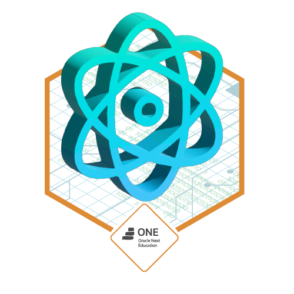

# 💬 Sobre mim:

 Desenvolvedor Front-End  🎓 Desenvolvimento de Software e Multiplataforma  🎓 Fatec - Registro  ⚡ Hobbies: Jogos, Musica e Musculação

#  4º Semestre da Graduação

  🗓️ 02/2023 - Até Agora

📌 React 
📌 Express 
📌 Bootstrap 
📌 Figma 

---

## 📫 Redes Sociais:

---

# 💻 Técnologias:
  

# Badges  

# 📊 GitHub:

|  |  |
|---|---|

